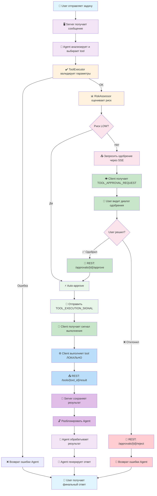

# Agent Tools System - Полный рабочий процесс

## Обзор

Agent Tools System использует асинхронный workflow, где:
- **Agent** работает на сервере и вызывает методы ToolExecutor напрямую
- **Server** валидирует, оценивает риски и запрашивает одобрение
- **Client** (VS Code Extension) слушает SSE уведомления и отправляет результат через REST API
- **SSE** используется для уведомлений (client слушает)
- **REST API** используется для отправки результата и одобрения (client → server)

---

## Полный Flow Выполнения Tool

### Диаграмма (Mermaid)



### Текстовое описание

```
┌─────────────────────────────────────────────────────────────┐
│ 1. USER sends message/task to chat                          │
│    REST API: POST /my/projects/{project_id}/chat/messages   │
└─────────────────┬───────────────────────────────────────────┘
                  │
                  ▼
┌─────────────────────────────────────────────────────────────┐
│ 2. SERVER receives message                                  │
│    Agent starts working on task (internal process)          │
└─────────────────┬───────────────────────────────────────────┘
                  │
                  ▼
┌─────────────────────────────────────────────────────────────┐
│ 3. AGENT chooses tool to solve task                         │
│    (e.g., read_file, execute_command, write_file)           │
│                                                              │
│    Agent calls ToolExecutor internally:                      │
│    await tool_executor.execute_tool(                         │
│      tool_name="execute_command",                            │
│      tool_params={"command": "npm", "args": ["test"]},       │
│      session_id=chat_session_id                              │
│    )                                                         │
└─────────────────┬───────────────────────────────────────────┘
                  │
                  ▼
┌─────────────────────────────────────────────────────────────┐
│ 4. SERVER validates parameters                              │
│    - PathValidator (for read/write/list)                    │
│    - CommandValidator (for execute_command)                 │
│    - SizeLimiter (size constraints)                          │
│    On error → return error to Agent                          │
└─────────────────┬───────────────────────────────────────────┘
                  │
                  ▼
┌─────────────────────────────────────────────────────────────┐
│ 5. SERVER assesses RISK LEVEL                               │
│    - RiskAssessor classifies: LOW / MEDIUM / HIGH            │
│    - Creates ToolExecution record in DB                      │
│      Status: PENDING                                         │
└─────────────────┬───────────────────────────────────────────┘
                  │
                  ▼
         LOW RISK? ─────────────────┐
        /                           │
       NO                          YES
       │                            │
       ▼                            ▼
   ┌──────────────────────┐   ┌────────────────┐
   │ 6a. REQUEST APPROVAL │   │ 6b. AUTO-APPR. │
   │                      │   │                │
   │ MEDIUM/HIGH risk:    │   │ LOW risk:      │
   │ ApprovalManager      │   │ Auto-approved  │
   │ .request_tool...()   │   │                │
   │                      │   │ Status:        │
   │ Status:              │   │ APPROVED       │
   │ AWAITING_APPROVAL    │   │                │
   │                      │   └────┬───────────┘
   │ Send SSE event to    │        │
   │ CLIENT:              │        │
   │ TOOL_APPROVAL_       │        │
   │ REQUEST              │        │
   │                      │        │
   │ {                    │        │
   │   "event":           │        │
   │   "tool.approval",   │        │
   │   "data": {          │        │
   │     "approval_id",   │        │
   │     "tool_name",     │        │
   │     "risk_level",    │        │
   │     "timeout"        │        │
   │   }                  │        │
   │ }                    │        │
   └──────────┬───────────┘        │
              │                    │
              ▼                    │
   ┌──────────────────────────┐   │
   │ 7. WAIT FOR APPROVAL     │   │
   │                          │   │
   │ ToolExecutor blocks:     │   │
   │ await approval_manager   │   │
   │ .wait_for_approval()     │   │
   │                          │   │
   │ CLIENT (VS Code):        │   │
   │ ├─ Receives SSE event    │   │
   │ ├─ Shows approval dialog │   │
   │ ├─ USER makes decision   │   │
   │ ├─ Sends REST request:   │   │
   │ │  POST /approvals/      │   │
   │ │  {approval_id}/approve │   │
   │ │  OR /reject            │   │
   │ └─ Server updates ApprovalRequest
   │                          │   │
   └──────────┬───────────────┘   │
              │                    │
         ┌────┴────┐               │
         │          │              │
      APPROVE   REJECT/TIMEOUT     │
         │          │              │
         ▼          ▼              │
    ┌────────┐  ┌──────┐           │
    │Return  │  │Return │          │
    │True to │  │False │           │
    │Agent   │  │to Agent │        │
    │        │  │       │          │
    │Status: │  │Status:│          │
    │APPROVED│  │REJEC. │          │
    │        │  │TIMEO. │          │
    └────┬───┘  └──┬────┘          │
         │         │               │
         │         ▼               │
         │    Agent continues      │
         │    but tool was         │
         │    not executed         │
         │    (skip tool)          │
         │                         │
         └─────────────────────────┘
              │
              ▼
   ┌──────────────────────────┐
   │ 8. SEND EXECUTION SIGNAL │
   │                          │
   │ (after approval SUCCESS) │
   │                          │
   │ ToolExecution status:    │
   │ APPROVED → EXECUTING     │
   │                          │
   │ Send SSE event to CLIENT:│
   │ TOOL_EXECUTION_SIGNAL    │
   │ {                         │
   │   "event":               │
   │   "tool.execute",        │
   │   "data": {              │
   │     "tool_id": "uuid",   │
   │     "tool_name": "cmd",  │
   │     "tool_params": {...} │
   │   }                       │
   │ }                         │
   │                          │
   │ Agent continues blocked: │
   │ await result from socket │
   │ or callback              │
   └──────────┬───────────────┘
              │
              ▼
   ┌──────────────────────────┐
   │ 9. CLIENT EXECUTES TOOL  │
   │                          │
   │ VS Code Extension:       │
   │ ├─ Receives SSE event    │
   │ ├─ Executes tool:        │
   │ │  - read_file: reads    │
   │ │  - write_file: writes  │
   │ │  - execute_command     │
   │ │  - list_directory      │
   │ └─ No waiting on server  │
   └──────────┬───────────────┘
              │
              ▼
   ┌──────────────────────────┐
   │ 10. CLIENT SENDS RESULT  │
   │                          │
   │ VS Code Extension:       │
   │                          │
   │ REST API:                │
   │ POST /my/projects/       │
   │      {project_id}/       │
   │      tools/{tool_id}/    │
   │      result              │
   │                          │
   │ {                         │
   │   "status": "completed",  │
   │   "result": {             │
   │     "success": true,      │
   │     "stdout": "...",      │
   │     "stderr": null,       │
   │     "exit_code": 0        │
   │   }                       │
   │ }                         │
   │                          │
   │ OR on error:              │
   │ {                         │
   │   "status": "failed",     │
   │   "error": "Command not"  │
   │   "found: npm"            │
   │ }                         │
   └──────────┬───────────────┘
              │
              ▼
   ┌──────────────────────────┐
   │ 11. SERVER RECEIVES      │
   │     RESULT (via REST)    │
   │                          │
   │ ToolExecution status:    │
   │ EXECUTING → COMPLETED    │
   │                          │
   │ Stores result in DB      │
   │                          │
   │ Notifies Agent:          │
   │ Agent event listener     │
   │ receives result          │
   │                          │
   │ Send SSE to CLIENT:      │
   │ TOOL_RESULT_ACK          │
   │ (optional ACK)           │
   └──────────┬───────────────┘
              │
              ▼
   ┌──────────────────────────┐
   │ 12. AGENT PROCESSES      │
   │     RESULT               │
   │                          │
   │ ToolExecutor unblocks    │
   │ Agent receives result    │
   │ from callback/event      │
   │                          │
   │ Agent continues task:    │
   │ ├─ Analyzes result       │
   │ ├─ May choose new tool   │
   │ ├─ Or generate final     │
   │ │  response to user      │
   │ └─ Sends message to chat │
   │                          │
   │ Database:                │
   │ Update ToolExecution:    │
   │ result = {...},          │
   │ completed_at = now,      │
   │ status = COMPLETED       │
   └──────────┬───────────────┘
              │
              ▼
   ┌──────────────────────────┐
   │ 13. USER receives        │
   │     response from Agent  │
   │                          │
   │ Chat message with:       │
   │ ├─ Tool execution result │
   │ ├─ Agent analysis        │
   │ ├─ Final answer          │
   │ └─ Tool execution         complete!
   └──────────────────────────┘
```

---

## Состояния Tool Execution

```
PENDING
  ├─ Параметры валидированы
  ├─ Риск оценен
  └─ Ожидание одобрения (если MEDIUM/HIGH risk)
  
AWAITING_APPROVAL
  ├─ Отправлен SSE event TOOL_APPROVAL_REQUEST
  ├─ Ожидание решения пользователя
  ├─ Agent заблокирован (ждёт результата)
  └─ Таймаут: MEDIUM=5мин, HIGH=10мин
  
APPROVED
  ├─ Пользователь одобрил или auto-approved
  ├─ Отправлена сигнал на клиент (TOOL_EXECUTION_SIGNAL)
  └─ Ожидание результата от клиента
  
EXECUTING
  ├─ Клиент выполняет инструмент локально
  └─ Agent ждёт результата
  
COMPLETED
  ├─ Результат получен от клиента (REST API)
  ├─ Agent разблокирован
  ├─ Обработан Agent-ом
  └─ Успешное завершение
  
REJECTED
  ├─ Пользователь отклонил одобрение
  ├─ Tool не выполнен
  └─ Agent продолжает без этого tool
  
TIMEOUT
  ├─ Истёк таймаут ожидания одобрения
  ├─ Tool не выполнен
  └─ Agent продолжает без этого tool
  
FAILED
  ├─ Ошибка валидации параметров
  ├─ Ошибка выполнения на клиенте
  └─ Agent получает ошибку
```

---

## REST API Endpoints

### 1. Submit Tool Result (from Client)

**Endpoint:** `POST /my/projects/{project_id}/tools/{tool_id}/result`

**Request (from Client - VS Code Extension):**
```json
{
  "status": "completed",
  "result": {
    "success": true,
    "stdout": "test output...",
    "stderr": null,
    "exit_code": 0
  }
}
```

Or with error:
```json
{
  "status": "failed",
  "error": "Command not found: npm"
}
```

**Response:**
```json
{
  "success": true,
  "tool_id": "123e4567-e89b-12d3-a456-426614174000",
  "status": "completed",
  "message": "Tool result processed"
}
```

**Status Codes:**
- 200: Result accepted and processed
- 404: Tool execution not found
- 400: Invalid result format
- 500: Server error

---

### 2. Approve Tool Execution (from Client)

**Endpoint:** `POST /my/projects/{project_id}/approvals/{approval_id}/approve`

**Request:**
```json
{
  "decision": "approved"
}
```

**Response:**
```json
{
  "success": true,
  "approval_id": "uuid",
  "status": "approved"
}
```

---

### 3. Reject Tool Execution (from Client)

**Endpoint:** `POST /my/projects/{project_id}/approvals/{approval_id}/reject`

**Request:**
```json
{
  "reason": "User declined execution"
}
```

**Response:**
```json
{
  "success": true,
  "approval_id": "uuid",
  "status": "rejected"
}
```

---

### 4. List Available Tools

**Endpoint:** `GET /my/projects/{project_id}/tools/available`

**Response:**
```json
{
  "success": true,
  "tools": [
    {
      "name": "read_file",
      "description": "Read file contents",
      "parameters": {
        "path": {"type": "string"}
      },
      "requires_approval": false,
      "risk_level": "LOW",
      "timeout_seconds": 0
    },
    {
      "name": "execute_command",
      "description": "Execute shell command",
      "parameters": {
        "command": {"type": "string"},
        "args": {"type": "array"},
        "timeout": {"type": "integer"}
      },
      "requires_approval": true,
      "risk_level": "MEDIUM",
      "timeout_seconds": 300
    }
  ],
  "total_count": 4
}
```

---

## SSE Events (Server → Client)

**Note:** Client only LISTENS to these events via SSE. Client does NOT send events.

### TOOL_APPROVAL_REQUEST

Sent when MEDIUM/HIGH risk tool requires user approval.

```json
{
  "event": "tool.approval_request",
  "data": {
    "approval_id": "uuid",
    "tool_id": "uuid",
    "tool_name": "execute_command",
    "risk_level": "MEDIUM",
    "timeout_seconds": 300,
    "description": "Execute npm test",
    "timestamp": "2026-02-21T06:19:00Z"
  }
}
```

**Client Action:**
- Show approval dialog to user
- Wait for user decision
- Send decision via REST API (approve/reject)

---

### TOOL_EXECUTION_SIGNAL

Sent after approval (explicit or auto) to signal client to execute tool.

```json
{
  "event": "tool.execution_signal",
  "data": {
    "tool_id": "uuid",
    "tool_name": "execute_command",
    "tool_params": {
      "command": "npm",
      "args": ["test"],
      "timeout": 30
    },
    "timestamp": "2026-02-21T06:19:01Z"
  }
}
```

**Client Action:**
- Execute tool locally
- Capture result (stdout, stderr, exit code)
- Send result via REST API: `POST /tools/{tool_id}/result`

---

### TOOL_RESULT_ACK (Optional)

Sent after server receives tool result.

```json
{
  "event": "tool.result_ack",
  "data": {
    "tool_id": "uuid",
    "status": "received",
    "timestamp": "2026-02-21T06:19:05Z"
  }
}
```

---

## Database Schema (ToolExecution)

```python
class ToolExecution(Base):
    __tablename__ = "tool_executions"
    
    id = Column(UUID, primary_key=True)
    user_id = Column(UUID, index=True)
    project_id = Column(UUID, index=True)
    session_id = Column(UUID)
    approval_id = Column(UUID)
    
    # Tool details
    tool_name = Column(String(50), index=True)
    tool_params = Column(JSON)           # Masked
    result = Column(JSON)                # Result from client
    
    # Risk & approval
    risk_level = Column(String(20))      # LOW, MEDIUM, HIGH
    requires_approval = Column(Boolean)
    
    # Status tracking
    status = Column(String(50), index=True)  # PENDING, AWAITING_APPROVAL, APPROVED, EXECUTING, COMPLETED, REJECTED, TIMEOUT, FAILED
    
    # Error handling
    error = Column(String(1000))
    error_type = Column(String(100))
    
    # Performance metrics
    execution_time_ms = Column(Integer)
    
    # Timestamps
    created_at = Column(DateTime, index=True)
    completed_at = Column(DateTime)
    approved_at = Column(DateTime)
```

---

## Agent Integration

### How Agent Uses ToolExecutor

```python
# In Agent code (server-side, internal)

class Agent:
    async def solve_task(self, task: str, session_id: UUID):
        # Agent analyzes task and decides to use a tool
        
        try:
            # Call ToolExecutor internally (NOT via REST API)
            response = await self.tool_executor.execute_tool(
                tool_name="execute_command",
                tool_params={
                    "command": "npm",
                    "args": ["test"],
                    "timeout": 30
                },
                session_id=session_id
            )
            
            # Response structure:
            # {
            #   "tool_id": "uuid",
            #   "tool_name": "execute_command",
            #   "status": "pending" | "awaiting_approval" | "completed" | "rejected" | "failed",
            #   "result": {...},
            #   "error": "...",
            #   "approval_id": "uuid"
            # }
            
            if response.status == "completed":
                # Success - Agent has result
                tool_result = response.result
                # Continue with next steps
                
            elif response.status == "rejected":
                # User rejected - Agent continues without this tool
                # Try alternative approach
                
            elif response.status == "awaiting_approval":
                # This shouldn't happen - ToolExecutor blocks until approval
                # But for some reason it's still pending
                pass
                
            elif response.status == "failed":
                # Validation error
                error_msg = response.error
                # Handle error
                
        except Exception as e:
            # Handle exceptions
            logger.error(f"Tool execution error: {e}")
```

### How ToolExecutor Blocks Agent

```python
async def execute_tool(self, tool_name, tool_params, session_id):
    """
    This method blocks (awaits) until:
    1. LOW risk: Returns immediately (auto-approved)
    2. MEDIUM/HIGH risk: 
       a. Sends approval request to client (SSE)
       b. Blocks in wait_for_approval() loop
       c. User approves → sends execution signal (SSE) to client
       d. Blocks in wait_for_tool_result() loop
       e. Client sends result via REST API
       f. Returns with completed status
    """
```

---

## Client Integration (VS Code Extension Example)

```javascript
// VS Code Extension - client side

const eventSource = new EventSource('/my/projects/{projectId}/chat/stream');

eventSource.addEventListener('tool.approval_request', (event) => {
  const data = JSON.parse(event.data);
  const { approval_id, tool_name, risk_level, timeout_seconds } = data;
  
  // Show approval dialog
  const approved = showApprovalDialog(tool_name, risk_level, timeout_seconds);
  
  if (approved) {
    // Send approval via REST
    fetch(`/my/projects/${projectId}/approvals/${approval_id}/approve`, {
      method: 'POST',
      body: JSON.stringify({ decision: 'approved' })
    });
  } else {
    fetch(`/my/projects/${projectId}/approvals/${approval_id}/reject`, {
      method: 'POST',
      body: JSON.stringify({ reason: 'User declined' })
    });
  }
});

eventSource.addEventListener('tool.execution_signal', async (event) => {
  const data = JSON.parse(event.data);
  const { tool_id, tool_name, tool_params } = data;
  
  try {
    // Execute tool locally
    const result = await executeToolLocally(tool_name, tool_params);
    
    // Send result back via REST API
    const response = await fetch(
      `/my/projects/${projectId}/tools/${tool_id}/result`,
      {
        method: 'POST',
        headers: { 'Content-Type': 'application/json' },
        body: JSON.stringify({
          status: 'completed',
          result: result
        })
      }
    );
    
    console.log('Tool result sent successfully');
  } catch (error) {
    // Send error back
    await fetch(
      `/my/projects/${projectId}/tools/${tool_id}/result`,
      {
        method: 'POST',
        body: JSON.stringify({
          status: 'failed',
          error: error.message
        })
      }
    );
  }
});
```

---

## Key Differences from Simple Implementation

| Aspect | Simple (Wrong) | Correct (Async) |
|--------|---|---|
| **API Usage** | Agent calls REST API to ToolExecutor | Agent calls ToolExecutor methods internally |
| **Blocking** | Server waits for immediate result | Server sends signal to client, waits async |
| **Client Role** | Executes on request (sync) | Executes independently (async) |
| **Result Flow** | Immediate response | Client sends via REST API later |
| **Scalability** | Limited (server resources) | Better (distributed) |
| **UX** | No approval dialog | Approval dialog + async execution |

---

## Notes

- All timestamps in ISO 8601 UTC format
- Tool execution is **asynchronous** - Agent awaits but doesn't block server
- SSE used only for **server→client notifications**
- REST API used for **client→server data** (result, approval decision)
- Approval timeout auto-rejects (no execution happens)
- Each tool execution tracked independently in database
- Agent code runs synchronously but internally uses async/await
