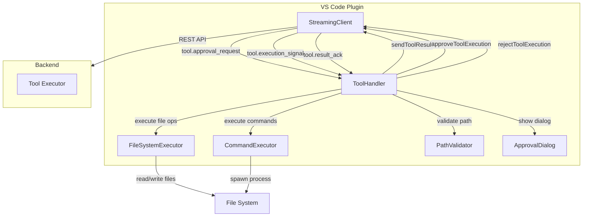
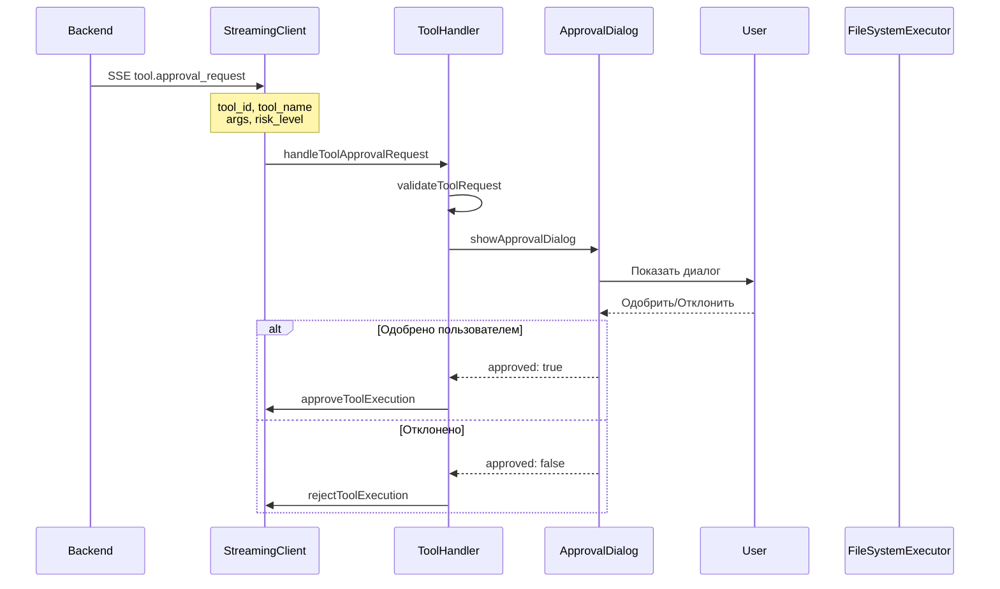
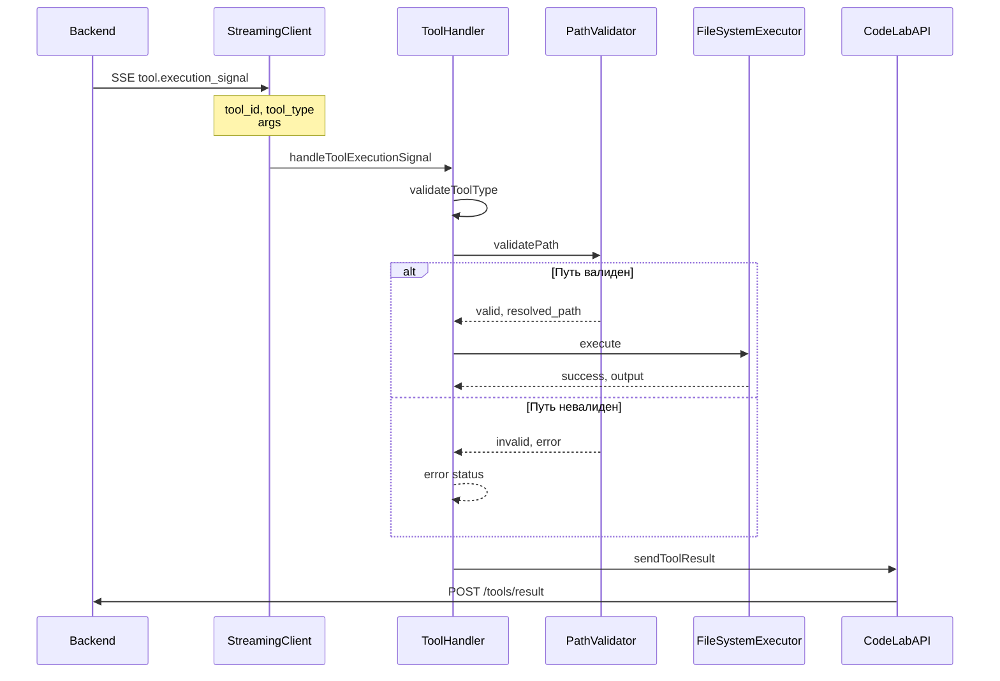
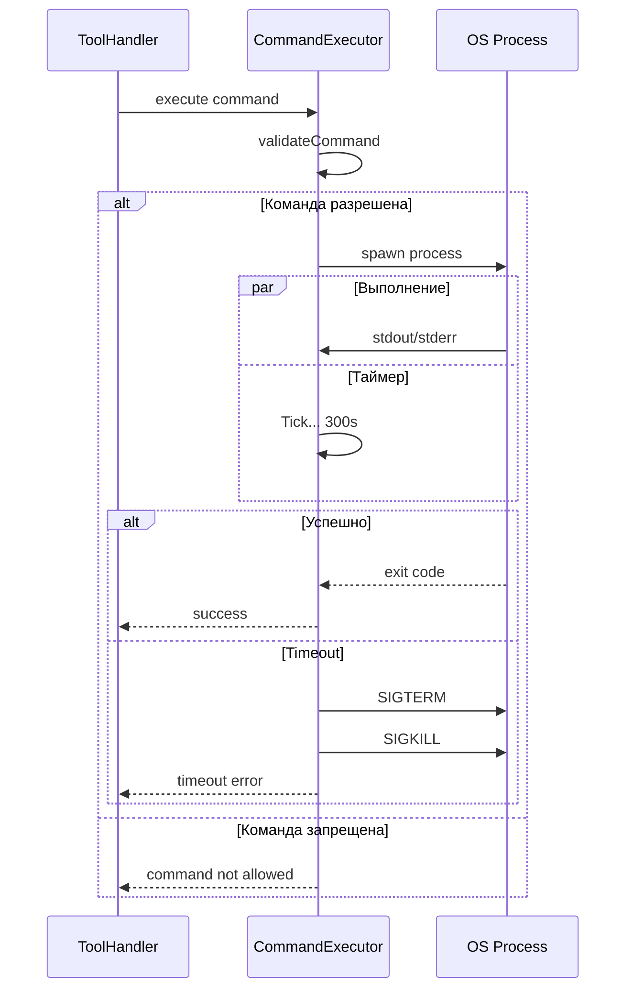

# Design: Архитектура Tool Execution Flow

## Архитектурный обзор

Tool execution flow состоит из 5 основных компонентов:



## Диаграммы последовательности

### 1. Flow запроса одобрения Tool



### 2. Flow сигнала выполнения Tool



### 3. Flow выполнения команды с timeout



## Структура модулей

### `src/tools/` модули

```
src/tools/
├── types.ts
│   ├── ToolEvent (Union Type)
│   │   ├── ToolApprovalRequest
│   │   ├── ToolExecutionSignal
│   │   └── ToolResultAck
│   ├── ToolResult
│   ├── ExecutionContext
│   └── ToolConfig
│
├── handler.ts
│   ├── ToolHandler (главный оркестратор)
│   │   ├── handleToolApprovalRequest()
│   │   ├── handleToolExecutionSignal()
│   │   ├── handleToolResultAck()
│   │   ├── requestUserApproval()
│   │   └── executeAndReport()
│   └── ToolHandlerConfig
│
├── executors/
│   ├── base.ts
│   │   └── BaseToolExecutor (Abstract)
│   │
│   ├── file-system.ts
│   │   ├── FileSystemExecutor
│   │   │   ├── executeReadFile()
│   │   │   ├── executeWriteFile()
│   │   │   ├── executeListDirectory()
│   │   │   └── checkPermissions()
│   │   └── FileOperationError
│   │
│   └── command.ts
│       ├── CommandExecutor
│       │   ├── executeCommand()
│       │   ├── spawnProcess()
│       │   ├── handleTimeout()
│       │   ├── validateCommand()
│       │   └── COMMAND_WHITELIST
│       └── CommandExecutionError
│
├── validators/
│   └── path.ts
│       ├── PathValidator
│       │   ├── validatePath()
│       │   ├── validateWorkspaceBoundary()
│       │   ├── checkFileSize()
│       │   └── resolvePath()
│       └── PathValidationError
│
└── __tests__/
    ├── handler.test.ts
    ├── file-system.test.ts
    ├── command.test.ts
    └── path.test.ts
```

## Интерфейсы и контракты

### SSE Event Schemas

SSE события включают следующие типы:

**ToolApprovalRequest**
- type: 'tool.approval_request'
- tool_id: уникальный идентификатор tool
- tool_name: имя tool (read_file, write_file, execute_command, list_directory)
- args: аргументы для tool
- risk_level: 'low' | 'medium' | 'high' | 'critical'
- estimated_duration_ms: примерное время выполнения

**ToolExecutionSignal**
- type: 'tool.execution_signal'
- tool_id: уникальный идентификатор tool
- tool_type: тип tool для выполнения
- args: аргументы для выполнения
- execution_context: контекст выполнения (была ли одобрена)

**ToolResultAck**
- type: 'tool.result_ack'
- tool_id: уникальный идентификатор tool
- receipt_status: 'received' | 'processed' | 'rejected'
- message: опциональное сообщение

### API Client методы

CodeLabAPI должен иметь следующие новые методы:

- `sendToolResult(toolId, result)` - отправить результат выполнения tool
- `approveToolExecution(toolId, metadata?)` - одобрить выполнение tool
- `rejectToolExecution(toolId, reason)` - отклонить выполнение tool

### ToolHandler интерфейс

ToolHandler - главный оркестратор для обработки tool событий:

- `handleToolApprovalRequest(event)` - обработать запрос на одобрение
- `handleToolExecutionSignal(event)` - обработать сигнал выполнения
- `handleToolResultAck(event)` - обработать подтверждение получения результата
- `dispose()` - очистить ресурсы

ToolHandler использует:
- FileSystemExecutor для файловых операций
- CommandExecutor для выполнения команд
- PathValidator для валидации путей
- ApprovalDialog для запроса одобрения пользователя

### Executor интерфейсы

**FileSystemExecutor**
- `executeReadFile(path, encoding?)` - прочитать файл
- `executeWriteFile(path, content)` - написать файл
- `executeListDirectory(path)` - список файлов в директории
- `validate(args)` - валидировать аргументы

**CommandExecutor**
- `executeCommand(command, args?, timeout?)` - выполнить команду
- `validate(args)` - валидировать аргументы

**PathValidator**
- `validatePath(path)` - полная валидация пути
- `validateWorkspaceBoundary(path)` - проверить границы workspace
- `checkFileSize(path, maxSize?)` - проверить размер файла
- `resolvePath(path)` - разрешить путь (normalize, resolve symlinks)

## Обработка ошибок

Стратегия обработки ошибок:

```
Ошибка в выполнении Tool
      ↓
Определить тип ошибки
      ↓
┌─────────────────────────────┬──────────────────────────┐
│                             │                          │
▼                             ▼                          ▼
PathValidationError    FileOperationError    CommandExecutionError
│                      │                     │
└─────────────────────────────┬──────────────┘
                              │
                              ▼
                    Логировать ошибку
                              │
                              ▼
                    Отправить результат с ошибкой
                              │
                              ▼
                    Backend обрабатывает ошибку
```

Типы ошибок:
- **PathValidationError** - невалидный путь (traversal, permission, size)
- **FileOperationError** - ошибка при файловой операции (не найден файл, permission denied)
- **CommandExecutionError** - ошибка при выполнении команды (exit code, signal)
- **TimeoutError** - превышен timeout выполнения
- **ApprovalDeniedError** - пользователь отклонил одобрение

## Управление состоянием

### ToolHandler состояние

ToolHandler отслеживает:

**Pending Approvals**
- Map с ожидающими одобрениями
- Для каждого: request, timeout, resolver функция

**Active Executions**
- Map с активными выполнениями
- Для каждого: signal, process, timeout

**Execution History**
- История всех выполнений (для аудита)
- Для каждого: toolId, status, startTime, endTime, error

**Concurrent Counter**
- Счетчик активных выполнений (max 3)

## Точки интеграции

### 1. Интеграция с StreamingClient

StreamingClient должен:
- Инициализировать ToolHandler в конструкторе
- Подписаться на tool события (tool.approval_request, tool.execution_signal, tool.result_ack)
- Маршрутизировать события в ToolHandler
- Очищать ресурсы при dispose

### 2. Инициализация в Extension

`src/extension.ts` должен:
- Создать инстанс ToolHandler
- Подключить его к StreamingClient
- Регистрировать в context.subscriptions для cleanup
- Очищать процессы и timeouts при deactivate

## Дизайн безопасности

### Стратегия валидации пути

```
Путь от пользователя
      ↓
[Нормализовать путь]
      ↓
[Разрешить симлинки]
      ↓
[Проверить workspace boundary]
      ↓
[Проверить размер файла]
      ↓
[Проверить permissions]
      ↓
[Выполнить или отклонить]
```

Валидация пути должна:
- Предотвращать path traversal (../)
- Проверять что путь в пределах workspace
- Разрешать симлинки только в пределах workspace
- Проверять размер файла (max 100MB)
- Проверять permissions через VS Code API

### Whitelist команд

Разрешенные команды:
- `ls`, `find` - листинг
- `cat`, `head`, `tail` - чтение
- `mkdir`, `touch`, `rm` - файловые операции
- `git` - version control (read-only)
- `npm`, `yarn`, `pnpm` - package management

Запрещенные команды:
- `sudo`, `su` - escalation
- `rm -rf /` - деструктивные операции
- `curl`, `wget` - сетевые операции
- `eval`, `bash -c` - code injection

## Соображения производительности

1. **Limit concurrency** - максимум 3 одновременных выполнений
2. **File size limits** - максимум 100MB за операцию
3. **Timeout defaults** - 5 минут на выполнение команды
4. **Result caching** - кэшировать результаты read_file на 5 минут
5. **Process management** - SIGTERM с fallback на SIGKILL

## Стратегия тестирования

### Unit тесты
- Валидация пути (traversal, symlinks, permissions)
- Файловые операции (read, write, list)
- Выполнение команд и whitelist валидация
- Обработка ошибок для каждого executor

### Integration тесты
- ToolHandler со всеми executors
- Парсинг и маршрутизация SSE событий
- Flow запроса одобрения
- Отправка результатов

### E2E тесты
- Full tool execution flow
- Взаимодействие с approval dialog
- Восстановление от ошибок
